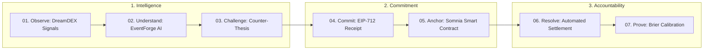
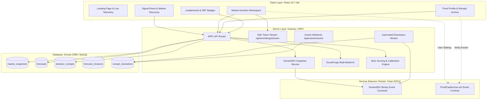

<div align="center">

# ↗ proofcast
### *Predictions are cheap. Proof is not.*

**The forecasting intelligence & cryptographic accountability layer built natively for Somnia DreamDEX Event Contracts.**

[](https://shannon-explorer.somnia.network)
[](contracts/ProofCastAnchor.sol)
[](https://docs.dreamdex.io)
[](shared/eip712.ts)
[](server/receipts.test.ts)
[](tsconfig.json)
[](LICENSE)

<br/>

```
  ┌──────────────┐     ┌──────────────┐     ┌──────────────┐     ┌──────────────┐     ┌──────────────┐
  │  01. OBSERVE │ ──> │02. UNDERSTAND│ ──> │  03. COMMIT  │ ──> │  04. ANCHOR  │ ──> │  05. PROVE   │
  │   DreamDEX   │     │  EventForge  │     │   EIP-712    │     │Somnia Anchor │     │ Brier Scores │
  └──────────────┘     └──────────────┘     └──────────────┘     └──────────────┘     └──────────────┘
```

</div>

---

> [!IMPORTANT]
> **Core Product Thesis**: Prediction markets show what the crowd prices. ProofCast records what a forecaster believed *before* the outcome was known, preserves *why* they believed it, and measures whether that judgment was empirically calibrated.

---

## 🏛️ The 7-Step Verified Lifecycle

ProofCast transforms speculative market noise into immutable decision intelligence across 7 deterministic phases:

$$\mathbf{OBSERVE} \longrightarrow \mathbf{UNDERSTAND} \longrightarrow \mathbf{CHALLENGE} \longrightarrow \mathbf{COMMIT} \longrightarrow \mathbf{ANCHOR} \longrightarrow \mathbf{RESOLVE} \longrightarrow \mathbf{PROVE}$$



---

## 🌐 Native Somnia & DreamDEX Architecture

ProofCast is engineered from the ground up for the **Somnia High-Performance L1 Blockchain** (`Chain ID: 50312`) and the **DreamDEX Prediction Market Protocol**:

```
 ┌─────────────────────────────────────────────────────────────────────────────┐
 │                         SOMNIA BLOCKCHAIN ECOSYSTEM                         │
 ├──────────────────────────────────────┬──────────────────────────────────────┤
 │         DreamDEX Protocol            │        ProofCast Protocol            │
 │  • Binary Event Contracts            │  • EventForge Multi-Model AI Engine  │
 │  • Order Book Spread & Depth         │  • SHA-256 Decision Receipts         │
 │  • ERC-6909 Outcome Tokens           │  • ProofCastAnchor.sol Contract      │
 │  • Automated Contract Settlement     │  • Payable Native $SOM Staking       │
 │  • Official @somnia-chain/markets-sdk│  • Soulbound Forecaster Badges (SBT) │
 └──────────────────────────────────────┴──────────────────────────────────────┘
```

---

## ⚡ Implemented Capabilities (Source of Truth)

### 1. 📡 Live Somnia DreamDEX Market Discovery
- **SDK Integration**: Direct live querying via `@somnia-chain/markets-sdk` reading Somnia DreamDEX binary event pools.
- **Order Book Microstructure**: Real-time bid/ask spreads, midpoints, depth levels, and time-to-expiry.
- **Honest Telemetry States**: Explicit `LIVE`, `STALE`, `UNAVAILABLE`, and `ERROR` states with a 5-second in-memory TTL cache to eliminate redundant indexer load.

### 2. 🧠 EventForge Dual-Layer AI Engine & SSE Streaming
- **Layer A (Deterministic Microstructure Engine)**: Pure mathematical model calculating objective fair value based on order-book depth imbalance, spread penalty, and time decay. Output is 100% deterministic: identical market inputs yield identical probability outputs.
- **Layer B (Multi-Model AI Reasoning & Live Streaming)**: Async structured inference generating Bull Case, Bear Case, Counter-Thesis, and Disagreement Analysis across supported models (Microstructure, Claude, Gemini, DeepSeek, and Meta-Ensemble).
- **Server-Sent Events (SSE)**: Mounted at `GET /api/eventforge/stream` for real-time token-by-token reasoning streaming.

> [!NOTE]
> **Hard Invariant**: The deterministic mathematical model is completely isolated from LLM output. AI models cannot alter numerical probabilities, fabricate order books, or mutate market prices.

### 3. 🎯 Triangulated Comparison & Executable Edge
- **3-Way Comparison**: Visual comparison between **Market Mid-Price**, **EventForge Fair Value**, and **User Forecast**.
- **Deterministic Market Quality**: Classifies markets into `"TRADEABLE" | "WATCH" | "NO_TRADE"`.
- **True Executable Edge**: Calculates net edge after accounting for spread crossing and execution friction.

### 4. 🔏 Cryptographic EIP-712 Receipts & Evidence Hashing
- **EIP-712 Typed Signing**: Standardized typed data verification (`domain: { name: "ProofCast", chainId: 50312 }`, primary type: `ForecastCommitment`) verified via `viem`.
- **SHA-256 Digest**: Freezes market snapshot, probability, direction, thesis, counter-thesis, and timestamp into an immutable 32-byte hash.
- **Parent-Linked Revision Chains**: Historical forecasts are never overwritten; corrections create parent-linked `forecast_revisions`.

### 5. 🛡️ Somnia Smart Contract Anchoring & Staking (`ProofCastAnchor.sol`)
- **Non-Custodial Anchoring**: Stores `(receiptHash, marketId, timestamp, owner, stakeAmount)`.
- **Payable $SOM Staking**: `anchorReceiptWithStake()` allows forecasters to stake native Somnia tokens behind high-conviction predictions.
- **Soulbound Forecaster Badges**: `recordForecasterBadge()` registers verified reputation tiers (`GOLD_MASTER`, `SILVER`, `BRONZE`, `UNRANKED`) directly on-chain.

### 6. ⚙️ Automated Resolution Worker & Oracle Webhooks
- **Automated Daemon Worker**: `server/resolutionWorker.ts` polls on-chain DreamDEX settlement status every 60 seconds without manual admin bottlenecks.
- **Oracle Webhook**: `POST /api/oracle/resolve` enables instant settlement for UMA / Chainlink oracles with `ORACLE_WEBHOOK_SECRET` authentication.
- **Automated Stake Resolution**: Automatically transitions stakes to `WON`, `LOST`, or `REFUNDED`.

### 7. 📊 Brier Calibration & Soulbound Reputation Tiers
- **Strict Brier Scoring**: Dimensionless $BS = (f - o)^2 \in [0, 1]$, where $0.000$ represents perfection.
- **Lead-Time Logarithmic Weighting**: Skill bonus for early commitments ($w = 1 + \ln(1 + \Delta t / 86400)$).
- **5-Bin Empirical Calibration**: Evaluates reliability across $[0-20\%]$, $[20-40\%]$, $[40-60\%]$, $[60-80\%]$, $[80-100\%]$.
- **Reputation Tier Matrix**:
  | Tier | Title | Requirements |
  | :--- | :--- | :--- |
  | 🥇 **Gold Master** | `Gold Master Oracle` | $\ge 30$ verified receipts, $BS \le 0.12$, Accuracy $\ge 70\%$ |
  | 🥈 **Silver** | `Silver Superforecaster` | $\ge 15$ verified receipts, $BS \le 0.18$, Accuracy $\ge 60\%$ |
  | 🥉 **Bronze** | `Bronze Forecaster` | $\ge 5$ verified receipts, $BS \le 0.25$, Accuracy $\ge 50\%$ |
  | 🔰 **Unranked** | `Unranked Apprentice` | $< 5$ verified receipts |

---

## 🏗️ System Architecture



---

## 🔒 Web3 Security & Trust Model

| Security Dimension | Enforcement Mechanism |
| :--- | :--- |
| **Zero Private Key Custody** | All transactions and EIP-712 hashes are signed in the browser wallet via RainbowKit / Viem. The server never handles private keys. |
| **Model Invariance** | Layer A deterministic calculations are mathematically isolated from LLM output. AI cannot modify probabilities or prices. |
| **Cryptographic Immutability** | Commitments produce a SHA-256 digest anchored permanently to [ProofCastAnchor.sol](contracts/ProofCastAnchor.sol) on Somnia. |
| **Webhook Authentication** | `POST /api/oracle/resolve` requires valid `ORACLE_WEBHOOK_SECRET` authentication to prevent unauthorized resolution spoofing. |
| **Duplicate Prevention** | `ProofCastAnchor.sol` reverts with `AlreadyAnchored` on replay attempts for previously anchored receipt hashes. |

---

## 🧪 Quality Gate & Test Verification

```bash
# Run full unit & integration test suite (9 test files, 42 tests)
npx vitest run

# Run strict TypeScript typechecking (0 errors)
npx tsc --noEmit

# Run production build
npm run build
```

```
 RUN  v2.1.9 /home/oyeolorun/ProofCast

 ✓ server/auth.logout.test.ts (1 test)
 ✓ server/comparisonMotion.test.ts (3 tests)
 ✓ server/dreamdex.test.ts (3 tests)
 ✓ server/eventforge.multimodel.test.ts (5 tests)
 ✓ server/eventforge.test.ts (7 tests)
 ✓ server/oracle.staking.test.ts (5 tests)
 ✓ server/receipts.test.ts (16 tests)
 ✓ server/scoring.api.test.ts (1 test)
 ✓ server/scoring.integration.test.ts (1 test)

 Test Files  9 passed (9)
      Tests  42 passed (42)
 TypeScript  0 diagnostics (tsc --noEmit clean)
 Build       Clean production bundle (135.0 kB)
```

---

## 📌 GitHub Repository Metadata (For Right-Hand Sidebar)

Use the following settings for the repository's "About" section on GitHub:

* **Description**:
  > Forecasting intelligence & cryptographic accountability platform for Somnia DreamDEX Event Contracts. Multi-model AI reasoning, EIP-712 SHA-256 Decision Receipts, payable $SOM staking, on-chain Soulbound reputation badges, and automated Brier calibration.
* **Website**:
  > `https://proofcast.somnia.network` *(or deployment domain)*
* **Topics / Tags**:
  ```text
  somnia, somnia-network, dreamdex, prediction-markets, eip-712, sha-256, brier-score, calibration, event-contracts, smart-contracts, solidity, typescript, trpc, web3, ai-reasoning, soulbound-tokens
  ```

---

## 📜 License

ProofCast is open-source software licensed under the [MIT License](LICENSE).


