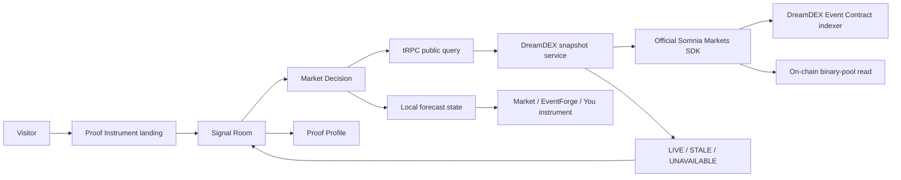

# ProofCast

[](https://github.com/0xaje/ProofCast/actions/workflows/ci.yml)

> **Predictions are cheap. Proof is not.**

ProofCast is a prediction-intelligence workspace for turning a live market signal into an accountable decision record. It is deliberately designed to keep **market context**, **model reasoning**, **a user forecast**, and **eventual evidence** separate—so a confident-looking conclusion never becomes a rewritten story.

The current application is a presentation-ready Proof Instrument: an editorial landing experience flows into a read-only Signal Room with verified DreamDEX Event Contract context, an evidence-first Market Decision surface, and a Proof Profile that refuses to invent account history.

## Product thesis

Market prices are useful inputs, but they are not a verdict. A credible prediction workflow should preserve what was visible at the time of a decision, make uncertainty explicit, and later compare the original commitment against the outcome. ProofCast is built around that loop.

| Stage | What ProofCast records or displays | What it intentionally does not do |
|---|---|---|
| **Observe** | A timestamped, read-only DreamDEX market snapshot and YES order-book context | Treat the market price as a recommendation |
| **Commit** | A local forecast probability and its distance from the market | Place an order, move funds, or imply execution |
| **Prove** | The structure for a Decision Receipt and an auditable outcome comparison | Fabricate forecast history, settlement results, or performance claims |

## Current capabilities

The application includes a public landing page, a unified Proof Instrument workspace, and a server-validated DreamDEX data path. The DreamDEX service uses the official Event Contracts SDK, identifies live markets by `marketId`, reads visible binary order-book context, and returns an explicit `LIVE`, `STALE`, `UNAVAILABLE`, or `ERROR` state. It creates no wallet, signer, balance, transaction, approval, order, or settlement capability.

The Market / EventForge / You comparison instrument is intentionally conservative. A Market bar moves only when a newer verified snapshot changes the displayed value. The EventForge bar is reserved for a future connected model estimate. The You bar moves only after an intentional local forecast adjustment. Every nonessential transition respects the visitor’s reduced-motion preference.

## Architecture



| Layer | Main technology | Responsibility |
|---|---|---|
| Product interface | React 19, Vite, Wouter, Tailwind | Landing, workspace routes, responsive Proof Instrument system, accessible interaction behavior |
| Application contract | tRPC and TanStack Query | Typed browser-to-server queries and refetch behavior |
| Server | Express 4 and TypeScript | Public snapshot procedures, safety boundaries, runtime composition |
| Market data | `@somnia-chain/markets-sdk` | Read-only Event Contract market discovery and binary order-book reads |
| Persistence-ready foundation | Drizzle ORM and MySQL/TiDB support | Future authenticated forecasts and Decision Receipts |

## Repository structure

```text
client/
  src/pages/            Public landing and Signal Room routes
  src/components/       Proof Instrument shell and UI components
  src/lib/              Typed client helpers and comparison-motion logic
server/
  dreamdex.ts           Read-only, bounded DreamDEX snapshot service
  routers.ts            tRPC application router
  *.test.ts             Server and source-aware-motion tests
drizzle/                Database schema and future migrations
.github/workflows/      CI workflow
docs/                   Contributor-facing environment configuration guidance
```

## Local setup

### Prerequisites

Use **Node.js 22** and **pnpm 10**. A database is optional for the current public read-only market experience, but it is required when you begin persisting user-owned forecasts or receipts.

```bash
git clone https://github.com/0xaje/ProofCast.git
cd ProofCast
corepack enable
pnpm install --frozen-lockfile
pnpm dev
```

The current read-only demo requires no wallet key or trading credential. If your standalone contribution requires local authentication, persistence, or platform-service configuration, follow the safe [environment configuration template](docs/environment-template.md) before starting the server. The development server prints the local address when it starts; open that address and begin at `/`.

## Live demo walkthrough

The project is designed for a short product demonstration without claiming unsupported execution capabilities.

1. Open the landing page and use **Open Signal Room** to establish the core premise: market signal, forecast commitment, and receipt are distinct evidence layers.
2. In **Signal Room**, inspect the current source state. A `LIVE` badge means a fresh verified DreamDEX snapshot is available; `STALE`, `UNAVAILABLE`, and `ERROR` are intentionally visible rather than disguised.
3. Open **Market Decision**. Review the selected Event Contract, Market / EventForge / You comparison band, and YES order-book evidence column.
4. Adjust the local forecast. The **You** bar moves only after that deliberate input. The control does not place a trade or create a persistent record.
5. Open **Proof Profile**. The empty receipt ledger is intentional: ProofCast does not make up performance, history, or resolved outcomes.

## Safety and contribution boundaries

ProofCast is currently **read-only** with respect to market data. Contributors must not add private keys, wallet approval paths, hidden automated orders, fabricated reviews, fake market records, or fabricated Decision Receipts. Any future execution flow must validate the on-chain market status, market metadata, tick, lot, liquidity, account state, and user confirmation immediately before signing.

When contributing, keep market data provenance visible, preserve the separate Market / EventForge / You lanes, add tests for state transitions, and run the local quality checks before opening a pull request.

```bash
pnpm test
pnpm check
pnpm build
```

## Environment configuration

Use the public [environment configuration template](docs/environment-template.md) to determine whether a local contribution needs configuration and which values are safe to set. Never commit `.env` files, credentials, wallet keys, session secrets, database passwords, or hosted-service tokens. The current DreamDEX read-only service is configured around public network endpoints and does not require a wallet private key.

## License

ProofCast is released under the [MIT License](LICENSE).

## References

[1] [DreamDEX Event Contracts documentation](https://docs.dreamdex.io/developers/event-contracts)

[2] [Somnia Markets SDK](https://www.npmjs.com/package/@somnia-chain/markets-sdk)
