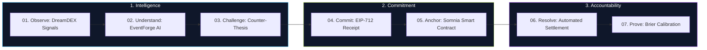
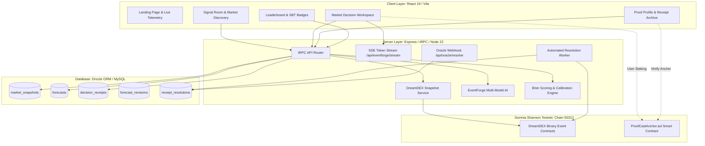

<div align="center">

# ↗ proofcast
### *Predictions are cheap. Proof is not.*

**The forecasting intelligence & cryptographic accountability layer built natively for Somnia DreamDEX Event Contracts.**

[](https://proofcast.onrender.com)
[](https://youtu.be/U1dPAt1yQfw)
[](https://shannon-explorer.somnia.network)
[](contracts/ProofCastAnchor.sol)
[](https://docs.dreamdex.io)
[](shared/eip712.ts)
[](server/receipts.test.ts)
[](tsconfig.json)
[](LICENSE)

<br/>

```
  ┌──────────────┐     ┌──────────────┐     ┌──────────────┐     ┌──────────────┐     ┌──────────────┐
  │  01. OBSERVE │ ──> │02. UNDERSTAND│ ──> │  03. COMMIT  │ ──> │  04. ANCHOR  │ ──> │  05. PROVE   │
  │   DreamDEX   │     │  EventForge  │     │   EIP-712    │     │Somnia Anchor │     │ Brier Scores │
  └──────────────┘     └──────────────┘     └──────────────┘     └──────────────┘     └──────────────┘
```

<br/>

### Official Video Walkthrough
[](https://youtu.be/U1dPAt1yQfw)

*Click the image above or visit [https://youtu.be/U1dPAt1yQfw](https://youtu.be/U1dPAt1yQfw) to watch the demonstration.*

</div>

---

## 1. Executive Summary

Prediction markets reflect what the crowd prices. However, crowd consensus is frequently warped by speculative hype, social media echo chambers, and hindsight bias. Traders delete losing forecasts, models claim high accuracy without verifiable records, and market participants fail to preserve *why* they held a belief before an outcome was decided.

**ProofCast** is the **native decision intelligence and cryptographic verification layer for Somnia DreamDEX Event Contracts**.

### Core Architecture Highlights
1. **Live DreamDEX Ingestion**: Direct integration with Somnia binary event pools and order-book depth via `@somnia-chain/markets-sdk`.
2. **EventForge Dual-Layer AI**: Deterministic order-book microstructure calculations coupled with real-time multi-model AI reasoning (Claude, Gemini, DeepSeek, Meta-Ensemble).
3. **EIP-712 Decision Receipts**: Forecasters freeze their probability, confidence, thesis, and counter-thesis into a signed SHA-256 cryptographic digest before outcome settlement.
4. **Somnia Smart Contract Anchoring & Staking**: Immutable on-chain anchoring via `ProofCastAnchor.sol` on Somnia Shannon Testnet, with optional native `STT` conviction staking, verified server-side against the mined transaction.
5. **Automated On-Chain Resolution & Brier Calibration**: Background daemons monitor on-chain settlements, auto-resolve receipts, and calculate empirical Brier calibration scores ($BS \in [0, 1]$), registering verified **Soulbound Reputation Badges** on-chain.

---

## 2. The 7-Step Verified Lifecycle

ProofCast converts market noise into immutable decision intelligence across 7 deterministic phases:

$$\mathbf{OBSERVE} \longrightarrow \mathbf{UNDERSTAND} \longrightarrow \mathbf{CHALLENGE} \longrightarrow \mathbf{COMMIT} \longrightarrow \mathbf{ANCHOR} \longrightarrow \mathbf{RESOLVE} \longrightarrow \mathbf{PROVE}$$



| Step | Phase | Description | Implementation Mechanism |
| :--- | :--- | :--- | :--- |
| **01. OBSERVE** | Market Discovery | Live ingestion of Somnia DreamDEX binary event markets, order books, and depth levels. | `@somnia-chain/markets-sdk` |
| **02. UNDERSTAND** | Multi-Model AI | Deterministic microstructure fair value + LLM Bull/Bear reasoning. | EventForge Multi-Model Engine |
| **03. CHALLENGE** | Stress-Test Edge | Force forecasters to articulate counter-theses and calculate net executable edge. | True Executable Edge Algorithm |
| **04. COMMIT** | Sign Receipt | User cryptographically signs forecast probability, thesis, and evidence before settlement. | EIP-712 Typed Data + SHA-256 Digest |
| **05. ANCHOR** | Somnia On-Chain | Anchor hash on Somnia Shannon Testnet; optional payable native `STT` staking. | `ProofCastAnchor.sol` Smart Contract |
| **06. RESOLVE** | Auto-Settlement | Background daemon detects DreamDEX contract settlement & oracle webhooks. | `resolutionWorker.ts` / Oracle Webhook |
| **07. PROVE** | Reputation & Calibration | Mathematical Brier calibration, lead-time bonuses, and on-chain Soulbound Badges. | Brier Scoring Engine + SBT Badges |

---

## 3. Somnia & DreamDEX Integration

ProofCast is engineered natively around the technical architecture of the **Somnia High-Performance L1 Blockchain** (`Chain ID: 50312`) and the **DreamDEX Prediction Market Protocol**:

```
 ┌────────────────────────────────────────────────────────────────────────────────────────┐
 │                              SOMNIA BLOCKCHAIN ECOSYSTEM                               │
 ├──────────────────────────────────────────┬─────────────────────────────────────────────┤
 │          DreamDEX Protocol               │             ProofCast Protocol              │
 │  • High-Throughput Binary Event Markets  │  • Multi-Model AI Decision Engine           │
 │  • On-Chain CLOB Order Book Depth        │  • Cryptographic EIP-712 Decision Receipts  │
 │  • ERC-6909 Multi-Token Outcome Shares   │  • Immutable Somnia Smart Contract Anchor   │
 │  • Automated Contract Payout Vectors     │  • Native STT Staking & Conviction Pool      │
 │  • Official @somnia-chain/markets-sdk    │  • Soulbound On-Chain Reputation Badges     │
 └──────────────────────────────────────────┴─────────────────────────────────────────────┘
```

* **Sub-Second Finality & Low Gas**: Enables high-frequency receipt anchoring and automated resolution without prohibitive overhead.
* **On-Chain Microstructure**: Real order-book bid/ask levels from DreamDEX feed directly into EventForge's deterministic fair-value engine.
* **Zero Private Key Custody**: ProofCast never takes custody of private keys; all transactions and typed commitments are signed in the user's browser wallet.

---

## 4. System Capabilities

### 4.1 Live DreamDEX Discovery & Telemetry
* Direct querying via `@somnia-chain/markets-sdk` reading Somnia DreamDEX binary event pools.
* Microstructure telemetry: real-time bid/ask spreads, midpoints, book depth, and expiry countdowns.
* Explicit telemetry states (`LIVE`, `STALE`, `UNAVAILABLE`, `ERROR`) backed by an in-memory 5-second TTL cache.

### 4.2 EventForge Dual-Layer AI & SSE Streaming
* **Layer A (Deterministic Microstructure Engine)**: Pure mathematical model computing fair value from order-book depth imbalance, spread penalty, and time decay. Output is 100% deterministic: identical market inputs yield identical probability outputs.
* **Layer B (Multi-Model AI Reasoning)**: Structured reasoning generating Bull Case, Bear Case, Key Risks, and Disagreement Analysis across Claude, Gemini, DeepSeek, and Meta-Ensemble. Live provider calls require the corresponding API keys; without them each model falls back to a built-in analytical engine and reports itself as `BUILTIN_ANALYTICAL` rather than `REAL_LLM`, which the UI surfaces per model.
* **Server-Sent Events (SSE)**: Mounted at `GET /api/eventforge/stream` for live token streaming.
* **Strict Invariant**: AI models cannot alter numerical probabilities, fabricate order books, or mutate market prices.

### 4.3 Triangulated Comparison & True Executable Edge
* **Triangulated Comparison**: Real-time comparison between **Market Price**, **EventForge Fair Value**, and **User Forecast**.
* **Market Quality Classification**: Categorizes market conditions into `TRADEABLE`, `WATCH`, or `NO_TRADE`.
* **True Executable Edge**: Calculates net edge after accounting for spread crossing and execution friction.

### 4.4 Cryptographic EIP-712 Receipts & Evidence Hashing
* **EIP-712 Typed Signing**: Standardized typed data verification (`domain: { name: "ProofCast", chainId: 50312 }`, primary type: `ForecastCommitment`) verified via `viem`.
* **SHA-256 Commitment Digest**: At commit time the server freezes the market evidence (mid, best bid, best ask, snapshot timestamp) together with the probability, direction, confidence, thesis, counter-thesis, and signer into an immutable 32-byte digest, stored as `decision_receipts.commitmentHash`.
* **Pre-Settlement Anchoring**: The commitment digest — not the post-resolution evidence hash — is the value anchored on Somnia. Because it is computed before the outcome is known, the anchor proves what was believed *prior* to settlement, which is the entire claim the product rests on.
* **Parent-Linked Revisions**: Historical forecasts are never overwritten; updates create parent-linked `forecast_revisions`. The anchored digest continues to represent the original commitment.

### 4.5 Somnia Smart Contract (`ProofCastAnchor.sol`) & Staking
* **Non-Custodial Anchoring**: Stores `(receiptHash, marketId, timestamp, owner, stakeAmount)`.
* **Payable STT Staking**: `anchorReceiptWithStake()` lets forecasters stake native Somnia tokens behind high-conviction predictions. The stake amount is chosen when the forecast is committed and is transferred on-chain at anchor time.
* **Server-Verified Stakes**: A client-reported transaction hash is only a claim. The server re-reads the mined transaction from a Somnia RPC and confirms it succeeded, targeted the anchor contract, and came from the claiming address. The recorded stake is always the value observed on-chain, never the amount requested — an intended-but-unpaid stake stays at `NONE` and is never settled.
* **Soulbound Forecaster Badges**: Registers verified reputation tiers (`GOLD_MASTER`, `SILVER`, `BRONZE`, `UNRANKED`) directly on-chain.

### 4.6 Automated Resolution Worker & Oracle Webhooks
* **Automated Daemon Worker**: `server/resolutionWorker.ts` polls on-chain DreamDEX settlement status every 60 seconds without manual bottlenecks.
* **Oracle Webhook**: `POST /api/oracle/resolve` enables sub-second settlement for UMA / Chainlink oracles. The endpoint **fails closed**: without `ORACLE_WEBHOOK_SECRET` configured it returns `503` rather than accepting anonymous settlement.
* **Conclusive Settlements Only**: A binary pool settles at `>= 99%` (YES) or `<= 1%` (NO). Any price in between means the market expired without a conclusive print and is recorded `VOID`, which is excluded from calibration scoring. Outcomes are never guessed.
* **Automated Stake Resolution**: Transitions on-chain-verified stakes to `WON`, `LOST`, or `REFUNDED`.

### 4.7 Brier Calibration & Soulbound Reputation Tiers
* **Strict Brier Scoring**: Dimensionless $BS = (f - o)^2 \in [0, 1]$, where $0.000$ represents perfection.
* **Lead-Time Logarithmic Weighting**: Skill bonus for early commitments ($w = 1 + \ln(1 + \Delta t / 86400)$).
* **5-Bin Empirical Calibration**: Evaluates reliability across $[0-20\%]$, $[20-40\%]$, $[40-60\%]$, $[60-80\%]$, $[80-100\%]$.
* **Reputation Tier Matrix**:
  | Tier | Title | Minimum Requirements |
  | :--- | :--- | :--- |
  | **Gold Master** | `Gold Master Oracle` | $\ge 30$ verified receipts, $BS \le 0.12$, Accuracy $\ge 70\%$ |
  | **Silver** | `Silver Superforecaster` | $\ge 15$ verified receipts, $BS \le 0.18$, Accuracy $\ge 60\%$ |
  | **Bronze** | `Bronze Forecaster` | $\ge 5$ verified receipts, $BS \le 0.25$, Accuracy $\ge 50\%$ |
  | **Unranked** | `Unranked Apprentice` | $< 5$ verified receipts |

### 4.8 Executive Web3 Terminal & Audit Suite
* **Tactile 1-Click Theme Engine**: Seamless toggle between sleek Cyberpunk Dark Mode and high-legibility Light Mode without disruptive text labels.
* **3-Stage Illuminated Decision Loop**: High-visibility real-time pipeline (`01 Observe`, `02 Commit`, `03 Prove`) linked to Somnia telemetry.
* **Architectural Decision Hygiene Suite**: Centers live order-book discovery, EventForge multi-model edge calculations, and cryptographic SHA-256 seal inspection.
* **Proof Profile & Calibration Suite**:
  - Real-time on-chain reputation progress tracker with progression to Gold Master / Silver / Bronze tiers.
  - Dual-view ledger terminal with instant multi-attribute search across local receipts and network-wide verified proofs.
  - Interactive 5-bin empirical reliability grid mapping predicted probabilities against observed market settlements.
  - One-click Somnia Shannon transaction explorer inspection and CSV export for independent audit.

---

## 5. System Architecture



---

## 6. Somnia Shannon Smart Contract Specification

* **Contract File**: [`contracts/ProofCastAnchor.sol`](contracts/ProofCastAnchor.sol)
* **Deployed Address**: [`0xe7da3a86ab86c3b5a09c992367083f1cec62d18e`](https://shannon-explorer.somnia.network/address/0xe7da3a86ab86c3b5a09c992367083f1cec62d18e)
* **Deployment Tx**: [`0x9f85fdde97a1149000f0ae4230daea2908c1d123701ff20c393d85a6b1031e46`](https://shannon-explorer.somnia.network/tx/0x9f85fdde97a1149000f0ae4230daea2908c1d123701ff20c393d85a6b1031e46)
* **Solidity Version**: `^0.8.20`
* **Target Network**: Somnia Shannon Testnet (`Chain ID: 50312`)
* **Currency**: Native `STT`

### Core Smart Contract Interfaces

```solidity
// Anchor a cryptographic decision receipt hash
function anchorReceipt(bytes32 receiptHash, string calldata marketId) external;

// Anchor a decision receipt with a payable native STT stake
function anchorReceiptWithStake(bytes32 receiptHash, string calldata marketId) external payable;

// Record a verified forecaster soulbound reputation badge (admin only)
function recordForecasterBadge(
    address forecaster,
    uint8 tier,
    uint256 brierScoreBps,
    uint256 verifiedCount
) external;

// Verify whether a receipt hash has been anchored
function verifyAnchor(bytes32 receiptHash) external view returns (
    bool isAnchored,
    string memory marketId,
    uint256 timestamp,
    address owner,
    uint256 stakeAmount
);

// Retrieve a forecaster's soulbound badge
function getForecasterBadge(address forecaster) external view returns (
    uint8 tier,
    uint256 brierScoreBps,
    uint256 verifiedCount,
    uint256 updatedAt
);
```

---

## 7. Quickstart & Deployment Guide

### Prerequisites
* **Node.js**: `v22.x` or higher
* **Package Manager**: `pnpm` (or `npm`)

### 1. Installation
```bash
# Clone repository
git clone https://github.com/0xaje/ProofCast.git
cd ProofCast

# Enable Corepack & Install dependencies
corepack enable
pnpm install
```

### 2. Running Locally
```bash
# Start development server
pnpm dev
```
The application will be accessible at `http://localhost:3000`.

### 3. Smart Contract Compilation & Deployment
```bash
# Compile ProofCastAnchor.sol
npm run contracts:compile

# Deploy to Somnia Shannon Testnet
SOMNIA_DEPLOYER_PRIVATE_KEY=0x... npm run contracts:deploy
```

### 4. Running Test Suite & Quality Gates
```bash
# Run full Vitest test suite
pnpm test

# Run strict TypeScript typechecking
pnpm check

# Run production bundle build
pnpm build
```

---

## 8. Test Verification & Health Summary

```
 RUN  v2.1.9 /home/oyeolorun/ProofCast

 ✓ server/auth.logout.test.ts (1 test)
 ✓ server/dreamdex.test.ts (3 tests)
 ✓ server/eventforge.multimodel.test.ts (5 tests)
 ✓ server/eventforge.test.ts (7 tests)
 ✓ server/integrity.test.ts (18 tests)
 ✓ server/oracle.staking.test.ts (5 tests)
 ✓ server/receipts.test.ts (16 tests)
 ✓ server/scoring.api.test.ts (1 test)
 ✓ server/scoring.integration.test.ts (1 test)
 ✓ client/src/lib/comparisonMotion.test.ts (3 tests)

 Test Files  10 passed (10)
      Tests  60 passed (60)
 TypeScript  0 diagnostics (tsc --noEmit clean)
 Production  Clean bundle build successful
```

---

## 9. Security & Trust Model

| Security Dimension | Enforcement Mechanism |
| :--- | :--- |
| **Zero Private Key Custody** | All transactions and EIP-712 hashes are signed in the browser wallet via RainbowKit / Viem. The server never handles private keys. |
| **Model Invariance** | Layer A deterministic calculations are mathematically isolated from LLM output. AI cannot modify probabilities or prices. |
| **Cryptographic Immutability** | Commitments produce a SHA-256 digest anchored permanently to [ProofCastAnchor.sol](contracts/ProofCastAnchor.sol) on Somnia. |
| **Webhook Authentication** | `POST /api/oracle/resolve` requires a valid `ORACLE_WEBHOOK_SECRET`. The endpoint **fails closed** — if no secret is configured it returns `503` rather than accepting anonymous settlement. |
| **Verified On-Chain Anchors** | A client-reported anchor transaction is re-read from a Somnia RPC before anything is recorded: it must have succeeded, targeted the anchor contract, been sent by the claiming address, and its calldata must contain exactly this receipt's commitment digest. Stakes are credited from the value observed on-chain, never from the client's request. |
| **No Fabricated Outcomes** | Receipts resolve only on a conclusive binary settlement print (`>= 99%` YES / `<= 1%` NO). Inconclusive expiries are recorded `VOID` and excluded from calibration scoring. |
| **Duplicate Prevention** | `ProofCastAnchor.sol` reverts with `AlreadyAnchored` on replay attempts for previously anchored receipt hashes. |

---

## 10. Hackathon Submission & Resources

* **Official Video Walkthrough**: [https://youtu.be/U1dPAt1yQfw](https://youtu.be/U1dPAt1yQfw)
* **Live Web Application**: [https://proofcast.onrender.com](https://proofcast.onrender.com)
* **Live Submission Guide**: [SUBMISSION_DEMO_GUIDE.md](SUBMISSION_DEMO_GUIDE.md)
* **System Audit**: [LIVE_SYSTEM_VERIFICATION.md](LIVE_SYSTEM_VERIFICATION.md)
* **Smart Contract**: [contracts/ProofCastAnchor.sol](contracts/ProofCastAnchor.sol)
* **Somnia Explorer**: [shannon-explorer.somnia.network](https://shannon-explorer.somnia.network)

---

## 11. License

ProofCast is open-source software licensed under the [MIT License](LICENSE).


