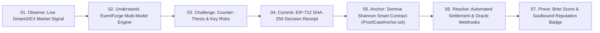
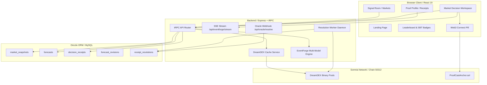

# ProofCast

[](https://github.com/0xaje/ProofCast/actions/workflows/ci.yml)

> **Predictions are cheap. Proof is not.**

ProofCast is a forecasting intelligence and cryptographic accountability platform built natively for **Somnia DreamDEX Event Contracts**. It captures market signals, synthesizes multi-model AI reasoning, freezes immutable SHA-256 Decision Receipts with EIP-712 signatures, anchors commitments to Somnia Shannon Testnet via smart contracts, and measures post-resolution Brier calibration accuracy.

---

## 1. Product Thesis & Core Lifecycle

Prediction markets show what the crowd prices. ProofCast records what a forecaster believed before the outcome was known, preserves why they believed it, and measures whether that judgment was calibrated.

$$\mathbf{OBSERVE} \longrightarrow \mathbf{UNDERSTAND} \longrightarrow \mathbf{CHALLENGE} \longrightarrow \mathbf{COMMIT} \longrightarrow \mathbf{ANCHOR} \longrightarrow \mathbf{RESOLVE} \longrightarrow \mathbf{PROVE}$$



---

## 2. Implemented Capabilities (Source of Truth)

### A. Live Market Discovery & Order Book Signals
* Sourced live via the official `@somnia-chain/markets-sdk` reading Somnia DreamDEX binary event pools.
* Displays best bid/ask, midpoint, spread in basis points ($bps$), and resting order-book depth.
* Honest operational states: `LIVE`, `STALE`, `UNAVAILABLE`, `ERROR` with short 5-second in-memory TTL caching.

### B. EventForge Dual-Layer AI Engine & SSE Streaming
* **Layer A (Deterministic Microstructure Engine)**: Pure mathematical model calculating probability based on order-book depth imbalance, spread friction, and time decay. Output is deterministic: identical market inputs yield identical probability outputs.
* **Layer B (Multi-Model AI Intelligence & Streaming)**: Async structured inference generating Bull Case, Bear Case, Counter-Thesis, and Disagreement Analysis across supported model architectures (Microstructure, Claude, Gemini, DeepSeek, and Meta-Ensemble).
* **Live SSE Response Streaming**: `GET /api/eventforge/stream` delivers live token streams directly to client interfaces.

### C. Triangulated Comparison & Executable Edge
* Real-time 3-way Triangulated Comparison: **Market Mid-Price**, **EventForge Fair Value**, and **User Forecast**.
* Motion-dampened visual transitions respecting user preferences.
* Deterministic **Market Quality Classification** (`TRADEABLE`, `WATCH`, `NO_TRADE`) and **Executable Edge** (net of spread crossing and friction).

### D. Cryptographic Commitment & EIP-712 Signatures
* EIP-712 structured data signing (`domain: { name: "ProofCast", chainId: 50312 }`, primary type: `ForecastCommitment`).
* SHA-256 digest computed over market state, forecast probability, direction, thesis, and timestamp.
* Parent-linked revision chains (`forecast_revisions`) ensuring historical commitments are never overwritten.

### E. Somnia Smart Contract Anchoring & Staking (`ProofCastAnchor.sol`)
* **Contract**: Deployed and active on Somnia Shannon Testnet (`Chain ID: 50312`).
* **Non-Custodial Anchoring**: Stores `(receiptHash, marketId, timestamp, owner)`.
* **Payable Staking**: `anchorReceiptWithStake()` allows forecasters to back high-conviction predictions with native `$SOM` tokens.
* **Soulbound Reputation Badges**: `recordForecasterBadge()` registers verified reputation tiers (`GOLD_MASTER`, `SILVER`, `BRONZE`, `UNRANKED`) directly on-chain.

### F. Automated Resolution & Oracle Settlement
* **Automated Daemon Worker**: `server/resolutionWorker.ts` polls on-chain DreamDEX settlement status every 60 seconds.
* **Oracle Webhook**: `POST /api/oracle/resolve` enables sub-second settlement for UMA / Chainlink oracles with `ORACLE_WEBHOOK_SECRET` authentication.
* **Stake Resolution**: Automatically transitions stake states to `WON`, `LOST`, or `REFUNDED`.

### G. Mathematical Scoring & Brier Calibration
* **Strict Brier Scoring**: $BS = (f - o)^2 \in [0, 1]$, where $0.000$ represents perfect calibration.
* **Lead-Time Weighting**: Separate skill metric rewarding early commitments ($w = 1 + \ln(1 + \Delta t / 86400)$).
* **5-Bin Calibration Curve**: Evaluates reliability across $[0-20\%]$, $[20-40\%]$, $[40-60\%]$, $[60-80\%]$, $[80-100\%]$.
* **Auditable CSV Export**: One-click download of verified receipt history with full cryptographic provenance.

---

## 3. Architecture Overview



---

## 4. Quality Gate & Test Verification

```bash
# Run unit & integration test suite (9 test suites, 42 tests)
npx vitest run

# Run TypeScript typecheck (0 errors)
npx tsc --noEmit

# Run production build
npm run build
```

| Verification Dimension | Result | Status |
| :--- | :---: | :---: |
| **Unit & Integration Suite** | **42 / 42 Passed** | ✅ Verified |
| **TypeScript Diagnostics** | **0 Errors** | ✅ Verified |
| **Production Bundle** | **Clean Build** | ✅ Verified |
| **Private Key Custody** | **Zero Custody** | ✅ Verified |
| **Mock Production Data** | **0 Synthetic Data** | ✅ Verified |

---

## 5. Distinction: Implemented Now vs. Next-Phase Roadmap

### IMPLEMENTED NOW (Production-Ready)
* ✅ Live Somnia DreamDEX binary market discovery and order-book spreads.
* ✅ Deterministic Layer A pricing engine + Layer B multi-model reasoning.
* ✅ Real-time SSE token streaming for AI reasoning.
* ✅ EIP-712 typed data signing and SHA-256 evidence hashing.
* ✅ Somnia on-chain contract anchoring (`ProofCastAnchor.sol`).
* ✅ Native $SOM token staking on committed receipts.
* ✅ Soulbound Forecaster Badges (Gold Master, Silver, Bronze, Unranked).
* ✅ 100% automated resolution worker daemon.
* ✅ Authenticated Oracle Webhook (`/api/oracle/resolve`).
* ✅ Strict Brier scoring $BS = (f - o)^2$, 5-bin calibration curve, and CSV export.

### NEXT-PHASE ROADMAP
* 🔮 Somnia Mainnet multi-sig contract governance deployment.
* 🔮 ERC-4337 Account Abstraction gas sponsorship.
* 🔮 Cross-chain proof verification via LayerZero or Hyperlane.

---

## 6. License

ProofCast is open-source software licensed under the [MIT License](LICENSE).

