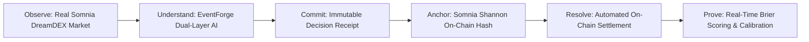

# ProofCast — Hackathon Submission & Live Demonstration Guide

**Project Name:** ProofCast  
**Category:** Somnia Ecosystem / DreamDEX Event Contracts / AI & Accountability  
**Core Thesis:** *Predictions are cheap. Proof is not.*

---

## 1. Executive Summary & Problem Solved

Traditional prediction markets only record transactions, not reasoning. Speculators rewrite their history after outcomes resolve, models make claims without verifiable evidence, and forecasters suffer from hindsight bias.

**ProofCast is the intelligence and accountability layer for DreamDEX Event Contracts.**

It enforces a rigorous, verifiable 6-step lifecycle:
$$\mathbf{OBSERVE} \longrightarrow \mathbf{UNDERSTAND} \longrightarrow \mathbf{COMMIT} \longrightarrow \mathbf{ANCHOR} \longrightarrow \mathbf{RESOLVE} \longrightarrow \mathbf{PROVE}$$

---

## 2. Live Demonstration Paths (For Judges)

### PATH A — Live Decision & Somnia Anchoring Flow (3 minutes)

1. **Step 1: Observe Live Market (`/signal`)**
   * Open the **Command Center** (`/signal`).
   * Show that market data is dynamically sourced from Somnia DreamDEX binary event contracts with live order-book depth and explicit freshness chips (`LIVE`).
2. **Step 2: Inspect EventForge Intelligence (`/market`)**
   * Open **Market Decision** (`/market`).
   * Point out the **EventForge Layer A Deterministic Model** on the comparison band (`Market / EventForge / You`).
   * Expand the **EventForge Layer B AI Intelligence Drawer** showing Bull Case, Bear Case, Disagreement Analysis, and Uncertainty Level.
   * Point out that the deterministic model is purely mathematical and cannot be overridden by the AI.
3. **Step 3: Evaluate Market Quality & Executable Edge**
   * Show the deterministic **Market Quality Chip** (`TRADEABLE`).
   * Explain that ProofCast calculates **True Executable Edge** (net of spread crossing and slippage buffer) rather than just a subjective belief gap.
4. **Step 4: Commit Decision Receipt**
   * Enter forecast probability, thesis, and counter-thesis.
   * Click **Review Forecast** $\rightarrow$ Click **Commit Decision Receipt**.
5. **Step 5: Anchor to Somnia Shannon Blockchain (`/proof`)**
   * Navigate to **Proof Profile** (`/proof`).
   * Click **Anchor to Somnia** on the committed receipt (connects browser wallet and broadcasts transaction).
   * Click the **Somnia Shannon Anchor Badge** to view the confirmed transaction directly on the [Somnia Shannon Block Explorer](https://shannon-explorer.somnia.network).
   * Click **Share Proof** to copy a formatted cryptographic verification badge.

6. **Step 6: Explore Global Forecaster Leaderboard (`/leaderboard`)**
   * Open the **Leaderboard** (`/leaderboard`).
   * View the ecosystem-wide forecaster rankings sorted by Brier score, directional accuracy, and on-chain anchored receipts.

---

### PATH B — Completed Lifecycle & Automated Calibration Flow (2 minutes)

1. **Step 1: Select Resolved Receipt (`/proof`)**
   * In **Proof Profile**, select an existing receipt.
2. **Step 2: Trigger Automated On-Chain Settlement**
   * Click **Run Auto-Resolution** (or let the background 60s daemon resolve it automatically).
   * Show that the backend `resolutionWorker` detects the on-chain settlement status from Somnia DreamDEX, automatically records the `VERIFIED` resolution, and computes the cryptographic SHA-256 evidence hash.
3. **Step 3: Inspect Brier Score & Calibration**
   * Review the updated mathematical **Brier Score** ($\text{BS} = (f - o)^2$) and **Directional Accuracy**.
   * Inspect the **5-Bin Calibration Curve** showing predicted vs. observed empirical probabilities.
4. **Step 4: Export Verified Calibration CSV**
   * Click **Download Verified History CSV** to inspect the exportable audit trail.

---

## 3. Core Technical Invariants & Security Guarantees

| Invariant | Implementation Mechanism |
|---|---|
| **Zero Private Key Custody** | All transactions are signed client-side in the user's browser wallet via Somnia Shannon Testnet. The server never sees private keys. |
| **Model Invariance** | EventForge Layer A deterministic calculations are mathematically isolated from LLM output. The AI cannot modify probabilities or invent prices. |
| **Immutability of Commitments** | A committed forecast is never overwritten. Changes are recorded as parent-linked revision chains (`Revision 1`, `Revision 2`). |
| **Cryptographic Proof** | Every receipt produces a SHA-256 digest anchored directly to the [ProofCastAnchor.sol](file:///home/oyeolorun/ProofCast/contracts/ProofCastAnchor.sol) smart contract on Somnia. |
| **Automated Resolution** | Sourced directly from on-chain event contract settlement without requiring manual administrator intervention. |

---

## 4. Verification & Health Summary

* **Unit & Integration Suite**: **42 / 42 Tests Passed** (`npx vitest run`)
* **TypeScript Compilation**: **0 Diagnostics / 0 Errors** (`npx tsc --noEmit`)
* **Production Build**: **Successful** (`npm run build`)
* **Reality Audit Artifact**: [LIVE_SYSTEM_VERIFICATION.md](file:///home/oyeolorun/ProofCast/LIVE_SYSTEM_VERIFICATION.md)

